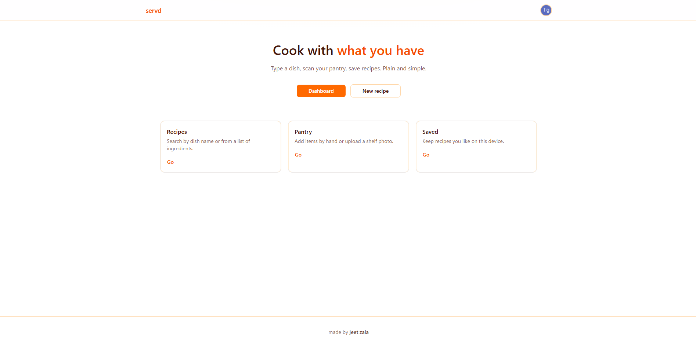

# 🍽️ AI Recipe Platform
AI-powered recipe platform for generating, discovering, and personalizing your cooking experience.

## About the project

### Features
- **Recipe Generation from Ingredients**: Enter the ingredients you have on hand and the AI instantly generates creative, step-by-step recipes — no wasted food, no extra trips to the store.
- **Image-Based Recipe Detection**: Upload a photo of any dish or ingredient and the AI will identify it and suggest matching recipes right away.
- **Personalized Recommendations**: The platform learns your taste preferences and dietary needs to serve up recipes tailored specifically to you.
- **Search Functionality**: Quickly search for recipes by name, ingredient, or cuisine to find exactly what you're craving.
- **User Profiles (To-Do)**: Planned feature to let users save their recipe history and share their favorite meals with others.
- **Community & Ratings (To-Do)**: Also planned — users will be able to rate recipes and leave reviews, building a community of home cooks.

### Build With
- [Next.js](https://nextjs.org/)
- [React](https://reactjs.org/)
- [Tailwind CSS](https://tailwindcss.com/)
- [GEMINI API](https://developers.generativeai.google.dev/gemini)
